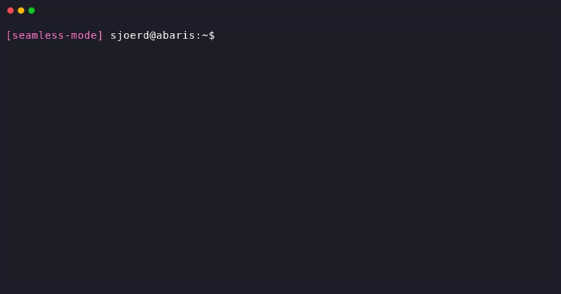

# Seamless

**Seamless: define your computation once — cache it, scale it, share it.**

Most computational pipelines are already reproducible — the same inputs produce the same outputs. Wrap your code as a step with declared inputs and outputs, and Seamless gives you caching (never recompute what you've already computed) and remote deployment (run on a cluster without changing your code). Remote execution also acts as a reproducibility test: if your wrapped code runs on a clean worker and produces the same result, it is reproducible. If not, Seamless has helped you find the problem — whether it's a missing input, an undeclared dependency, or a sensitivity to platform or library versions.

Seamless wraps both Python and command-line code. In Python, `direct` runs a function immediately; `delayed` records the function for deferred or remote execution. From the shell, `seamless-run` wraps any command as a Seamless transformation — no Python required. In both cases, the transformation is identified by the checksum of its code and inputs: identical work always produces the same identity.

Sharing works at two levels. The lightweight path is to exchange checksums: if two researchers have computed the same transformation, they already have the same result — no data transfer needed. The concrete path is to share the `seamless.db` file, a portable SQLite database that maps transformation checksums to result checksums. Copy it to a colleague, a cluster, or a publication archive, and every cached result travels with it. Combined, these two paths let a lab build up a shared computation cache that grows over time and never recomputes what anyone has already computed.

## What about interactivity?

This is Seamless 1.x, running on a new code architecture. Seamless 0.x offered an interactive, notebook-first workflow experience with reactive cells, Jupyter widget integration, filesystem mounting, and collaborative web interfaces. These
features are being ported to the new architecture. If your work is primarily
interactive/exploratory, you can use the [legacy version](https://sjdv1982.github.io/seamless/legacy/)
today, or watch this space for updates.

## Installation

```bash
pip install seamless-suite
```

This installs all standard Seamless components. For a minimal install, the core user-facing packages are:

| Package | Import | Provides |
| --- | --- | --- |
| `seamless-core` | `import seamless` | `Checksum`, `Buffer`, cell types, buffer cache |
| `seamless-transformer` | `from seamless.transformer import direct, delayed, parallel` | `direct`, `delayed`, `parallel`, `parallel_async`, `TransformationList`, `seamless-run`, `seamless-upload`, `seamless-download` |
| `seamless-config` | `import seamless.config` | `seamless.config.init()`, `seamless.config.set_nparallel()`, `seamless-init` |

## Quick Examples

### Python: `direct`

```python
from seamless.transformer import direct

@direct
def add(a, b):
    return a + b

add(2, 3)   # runs the function, returns 5
add(2, 3)   # cache hit — returns 5 instantly
```

### Command line: `seamless-run`

```bash
export SEAMLESS_CACHE=~/.seamless/cache     # global persistent caching

seamless-run 'seq 1 10 | tac && sleep 5'    # runs, caches result
seamless-run 'seq 1 10 | tac && sleep 5'    # cache hit — instant
```

### Python: bounded parallel batches

```python
import seamless.config
from seamless.transformer import delayed, parallel, TransformationList

seamless.config.set_nparallel(4)

@delayed
def add(a, b):
    return a + b

tflist = TransformationList([add(i, i) for i in range(20)], show_progress=True)
for tf in parallel(tflist):
    print(tf.value)
```

`parallel()` yields transformations in input order, but streams them as soon as each contiguous prefix has completed.

## Seamless mode

### Automatically wrap the bash commands you type



## Documentation

Full documentation — including getting-started guides, cluster setup, remote execution, and reference API — is at:

**<https://sjdv1982.github.io/seamless/>**

## Agent Skill

Seamless includes an agent skill (`seamless-adoption`) for AI coding assistants. It guides assessment of codebase fit and planning/executing ports — covering both the Python face (`direct`/`delayed`) and the Unix face (`seamless-run`). See [skills/seamless-adoption/SKILL.md](skills/seamless-adoption/SKILL.md).
