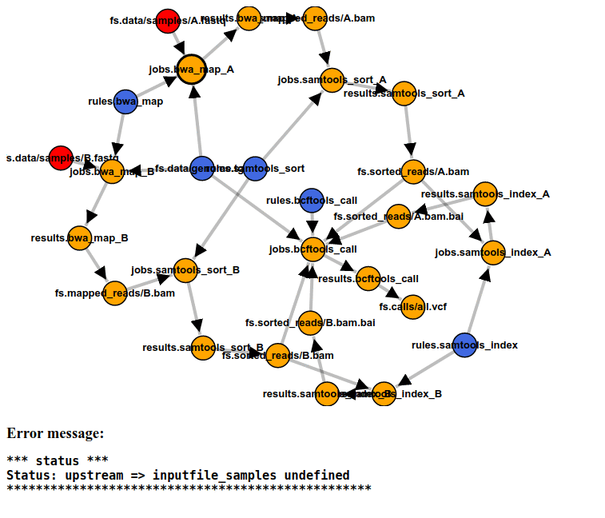

Snakemake example
=================

Snakefile and data are from the original Snakemake tutorial, with the following adaptations:

- The original `genome.fa` Snakemake dependency is unclean; `samtools` implicitly depends on `genome.fa.X`, where `X` = `anb`, `ann`, `bwt`, `fai`, `pac`, `sa`.
Therefore, all files have been zipped to `genome.tgz` ; the Snakefile has been adapted accordingly

- Seamless does not yet support Snakemake named inputs that are file lists. The rule `bcftools_call` has been adapted accordingly

- Seamless does not yet support Snakemake run functions, therefore the rule `report` will not work.

- The workflow runs very fast. Therefore, a five-second delay has been introduced for every rule.

How to run the example
======================

You will need to run it from a command line inside a Seamless Docker container. This can be done with `seamless-bash`, or with `seamless-jupyter` followed by opening a Jupyter command line terminal in the browser. The Snakemake example is bundled with the Seamless Docker container, under `~/seamless-examples/snakemake-tutorial-example`

1. Generate a Seamless graph by binding the Snakefile to the rule `bcftools_call` as follows:
`python ~/seamless-scripts/snakemake2seamless.py  bcftools_call`

2. The script `run-snakegraph.py` binds the contents of `/data` to the graph, and runs the computation.
NOTE: this script must be run inside a Docker container with samtools, bcftools and bwa installed! This can be done with the command `mamba install -c bioconda -c conda-forge samtools bcftools bwa`.
NOTE: as of March 2023, the command above does not work correctly with Python 3.10, including the Seamless Docker image, since bcftools (or its dependency htslib) expects OpenSSL 1.1, whereas Python 3.10 requires OpenSSL 3.

3. The Seamless graph can be run interactively using `ipython3 -i run-snakegraph-interactive.py`. This will create a live web page at http://localhost:5813/status/index.html that constantly shows the progress.

This will look like this:



In summary, the following commands will execute the workflow inside the Seamless Docker image:

```bash
seamless-bash
cd ~/seamless-examples/snakemake-tutorial-example
python3 ~/seamless-scripts/snakemake2seamless.py bcftools_call
mamba install -c bioconda -c conda-forge samtools bcftools bwa

python3 run-snakegraph.py
# or:
ipython3 -i run-snakegraph-interactive.py  # follow the instructions
```

## Running inside a conda environment

You will need to checkout seamless and seamless-tools on GitHub.

```bash
cd ~/seamless/seamless-examples/snakemake-tutorial-example
python3 ~/seamless-tools/scripts/snakemake2seamless.py bcftools_call
mamba install -c bioconda -c conda-forge samtools bcftools bwa

python3 run-snakegraph.py
# or:
ipython3 -i run-snakegraph-interactive.py  # follow the instructions
```

Results
=======

A file "calls/all.vcf" is generated (and no others). You can then run Snakemake ("snakemake report") to generate the report.

TODO: let snakemake2seamless report which files must be bound 

TODO: make a generic file binding tool. To make it work seamlessly, create a field {"meta": {"filebind": ("filesystem",)}} that shows to which cell a file must be bound. After that, a generic graph coloring script can do the job => no more run-snakegraph is needed.

TODO: test that shows that the singularity field becomes a Docker transformer. Running this requires that Seamless has access to Docker. For this, the Seamless container must have been started with `seamless-bash` or `seamless-jupyter`.
